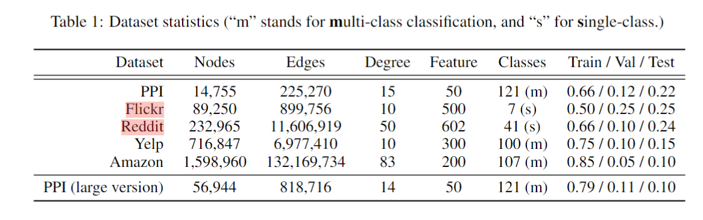

### Flickr Dataset

  - 参考
    - https://github.com/dmlc/dgl/blob/master/examples/pytorch/graphsaint/config.py

    - https://paperswithcode.com/sota/node-classification-on-flickr


    - hyperparams

      ```yaml
      dataset: flickr
      model: gcn
      num_layers: 2
      hidden_channels: 256
      dropout: 0.2
      
      log_steps: 1
      lr: 0.01
      wd: 0.0
      epochs: 500
      runs: 5
      ```


    - model params: 130567


    - Result: 
      - baseline: 53.05 ± 0.22
      - baseline + one virtual node: 52.95 ± 0.15
      - baseline + multiple virtual node(2):  53.10 ± 0.34


### Pubmed Dataset

  - 参考

    - https://paperswithcode.com/sota/node-classification-on-pubmed
    - https://github.com/dmlc/dgl/tree/master/examples/mxnet/gcn

  - nodes: 19717

  - edges: 88648

  - features: 500

  - class: 3

  - hyperparams

    ```yaml
    dataset: Pubmed
    model: gcn
    num_layers: 2
    hidden_channels: 16
    dropout: 0.5
    
    log_steps: 1
    lr: 0.01
    wd: 0.0005
    epochs: 300
    runs: 5
    use_bn: 0
    ```

  - result

    - parmas: 8099
    - baseline: 77.94
    - baseline + one virtual node: 78.64
    - baseline + multiple virtual node(2): 75.22 ± 0.48

  

### Reddit Dataset
predicting communities of online posts based on user comments

  - full-batch training: Out of memory
  - hyperparams

    ```yaml
    dataset: reddit
    model: sage
    num_layers: 3
    hidden_channels: 256
    dropout: 0.2

    log_steps: 1
    lr: 0.0001
    wd: 0.0
    epochs: 500
    runs: 5
    ```
